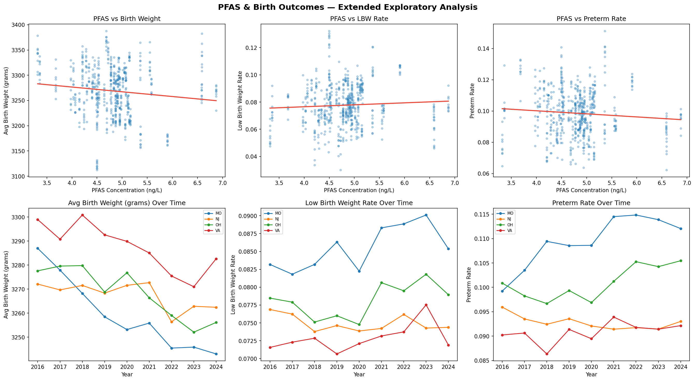
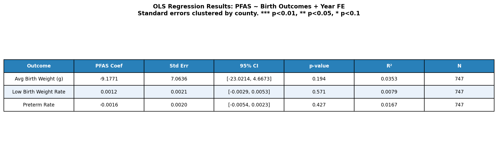

## Purpose

This report documents the workflow used to collect, clean, merge, and analyze
PFAS drinking water contamination data alongside CDC birth weight and gestational age records. It
is intended to make the analysis reproducible by showing the full path from raw
EPA monitoring data to the final county-year panel and downstream regression
results.

## 1. Data Sources

The analysis draws on four primary data sources:

- **EPA UCMR PFAS Monitoring Data**: Sample-level PFAS measurements (ng/L) from
public water systems, including minimum reporting levels and population served
- **EPA SDWA Geographic Areas**: Maps public water system IDs to the counties
they serve
- **Census National County FIPS Crosswalk**: Links county names to standardized
5-digit FIPS codes
- **CDC WONDER Weight at Birth**: County-year panel data on average birth weight,
birth counts, low birth weight rates, and preterm rates from 2016–2024
- **CDC WONDER Gestational Age at Birth**: County-year panel data on average gestational age and number of births at different gestational ages

## 2. Pipeline

The pipeline is implemented in the `pfas_birthweight` package, available on
PyPI. The main entry point is `build_extended_panel()`, which runs the full
pipeline end-to-end and returns a county-year DataFrame ready for analysis.

The pipeline runs through the following steps:

1. **Load and clean PFAS data**: Raw sample-level measurements are loaded from
the EPA monitoring file. Non-detects are replaced with half the minimum
reporting level (MRL/2), a standard imputation method in environmental health
research.
2. **Collapse to PWS level**: Samples are averaged to an unweighted mean at the
public water system level, retaining population served for later weighting.
3. **Merge with EPA geographic areas**: PWS IDs are matched to counties using
the EPA SDWA geographic areas dataset, filtering for county-level service area
codes.
4. **Aggregate to county level**: PFAS concentrations are aggregated to the
county level using population-weighted averages, grouping by state and county
to avoid collapsing same-named counties across states.
5. **Attach FIPS codes**: County names are standardized and matched to 5-digit
FIPS codes using the Census crosswalk, removing suffixes such as "County",
"Parish", and "City".
6. **Merge with birth outcome data**: County-level PFAS estimates are merged
onto the CDC WONDER panel by FIPS code, producing a county-year dataset. Low
birth weight rates and preterm rates are joined from separate CDC WONDER
extracts.
7. **Merge with gestational age data**: County-level gestational age estimates are merged
onto the CDC WONDER panel by FIPS code, producing a comprehensive county-year dataset.

**Data limitations:** Two sources of attrition merit note. CDC WONDER suppresses
cells for counties with fewer than 10 births in a given year for any category of birth. For example, if there were fewer than 10 births under 3000g in a given year, that cell would be suppressed, which may
undersample rural counties disproportionately. Additionally, not all PWS IDs
match to a county via the EPA geographic areas file, and not all county names
match cleanly to the Census crosswalk — unmatched counties are excluded from
the analysis. Non-detect imputation as MRL/2 follows standard practice.

## 3. Data Structure

The final panel produced by `build_extended_panel()` contains the following
columns:

| Column | Description |
|---|---|
| `FIPS` | 5-digit county FIPS code |
| `STATE` | 2-letter state abbreviation |
| `COUNTY_SERVED` | County name |
| `year` | Year (2016–2024) |
| `births` | Number of births |
| `avg_birth_weight` | Average birth weight (grams) |
| `PFAS_county` | Population-weighted mean PFAS concentration (ng/L) |
| `lbw_rate` | Low birth weight rate (births under 2,500g / total births) |
| `preterm_rate` | Preterm rate (births under 37 weeks / total births) |

This structure separates what was sourced directly from the raw data files from
what was derived during the pipeline, making it straightforward to trace any
column back to its origin.

## 4. Analysis

The final dataset contains 404 unique counties across 6 states with 747
county-year observations. Analysis is performed using OLS regression with year
fixed effects and standard errors clustered by county:

$$Y_{ct} = \beta \cdot \text{PFAS}_{c} + \gamma_t + \varepsilon_{ct}$$

Where $Y_{ct}$ is the birth outcome in county $c$ and year $t$, and $\gamma_t$
represents year fixed effects controlling for national trends over time. Because
PFAS exposure is collapsed to a single cross-sectional value per county, county
fixed effects are excluded by design as they would absorb the exposure variable
entirely. Standard errors are clustered at the county level to account for
serial correlation within counties over time. Based on prior environmental
health literature, we expect $\beta < 0$ for birth weight and $\beta > 0$ for
low birth weight and preterm rates.

Three outcomes are modeled separately: average birth weight, low birth weight
rate, and preterm rate. Results are presented alongside 95% confidence intervals
and significance stars following the convention *** p<0.01, ** p<0.05, * p<0.1.

## 5. Exploratory Data Analysis

Prior to regression, we examine the raw relationships between PFAS concentration
and each birth outcome across the 404 counties in the sample. The scatter plots
below show cross-sectional associations for the most recent year, while the time
trend charts track state-level averages from 2016–2024.



The scatter plots suggest a modest negative association between PFAS concentration
and average birth weight, consistent with prior literature. The relationship with
low birth weight rate is weakly positive, and the preterm rate trend line is
nearly flat, suggesting limited cross-sectional signal in the raw data.The time trends reveal meaningful variation across states. Alabama consistently
shows the lowest average birth weights and highest preterm rates, while New
Jersey and Virginia tend to perform better on both measures. Year fixed effects
are included in the regression to account for the fact that all states trend
downward in birth weight over time. We aimed to absorb that shared national pattern so
the PFAS coefficient reflects cross-county differences in exposure rather than
a common time trend.

## 6. Regression Results

OLS regression results are presented for all three birth outcomes in the table
below. Across all three models, the coefficient on PFAS concentration is small
in magnitude and statistically indistinguishable from zero. Average birth weight
shows the largest point estimate at -9.18 grams per ng/L increase in PFAS
(p=0.194), but the confidence interval [-23.02, 4.67] comfortably spans zero.
The LBW rate coefficient is 0.0012 (p=0.571) and the preterm rate coefficient
is -0.0016 (p=0.427), both negligible in magnitude. R² values across all three
models are below 0.04, indicating that PFAS concentration and year fixed effects
together explain very little of the variation in birth outcomes in this sample.



These null results should be interpreted carefully rather than taken as evidence
that PFAS exposure has no effect on birth outcomes. Several features of the data
and research design likely limit statistical power:

**Limited EPA reporting coverage.** PFAS concentrations in the sample range from
approximately 3.5 to 8.5 ng/L, but this likely understates true exposure. The
EPA's monitoring programs test for a limited subset of PFAS compounds, leaving
many variants undetected. With most counties clustered in a narrow band of
reported concentrations, the exposure variable may not capture meaningful
differences in total PFAS burden across counties.

**Ecological aggregation.** County-level averages are a coarse proxy for
individual exposure. Measurement error introduced by aggregating across all
water systems within a county could attenuate the PFAS
coefficient toward zero. Studies that find significant associations typically
use individual-level biomarker data rather than area-level estimates.

**Geographic scope.** The sample covers six states and 404 counties, which is
not nationally representative. If the relationship between PFAS and birth
outcomes varies by region for reasons such as differences in baseline health, economic demographics,
or co-exposures then estimates from this sample may not generalize.

**Time-invariant exposure.** Because PFAS is collapsed to a single county-level
average across the full monitoring period, the regression cannot exploit
within-county changes in exposure over time. Any causal identification relies
entirely on cross-sectional variation, which is more susceptible to confounding
by unobserved county characteristics.

Taken together, these limitations suggest the null result is likely a product of data constrains and should not be taken as conclusive. Future work with
broader geographic coverage, individual-level exposure data, or longitudinal
PFAS measurements would provide a stronger test of the relationship.

## 7. Reproducibility

To reproduce the analysis:

1. Install the package: `pip install pfas-birthweight`
2. Ensure the bundled data files are present (included in the PyPI distribution)
3. Run the pipeline:

```python
from pfas_birthweight import build_extended_panel

panel = build_extended_panel()
```

The pipeline is deterministic given the same input files. If the underlying EPA
or CDC data files are updated, the package version should be incremented and the
analysis rerun from scratch.

## 8. Exploration

After building the panel, the dataset can be explored interactively using the
Streamlit app:

```bash
streamlit run app.py
```

The app provides scatter plots of PFAS concentration against each birth outcome,
county-level choropleth maps toggling between PFAS and outcome variables, time
trend charts by state, and a regression results table. Each of these visualizations
is filterable by state and year.